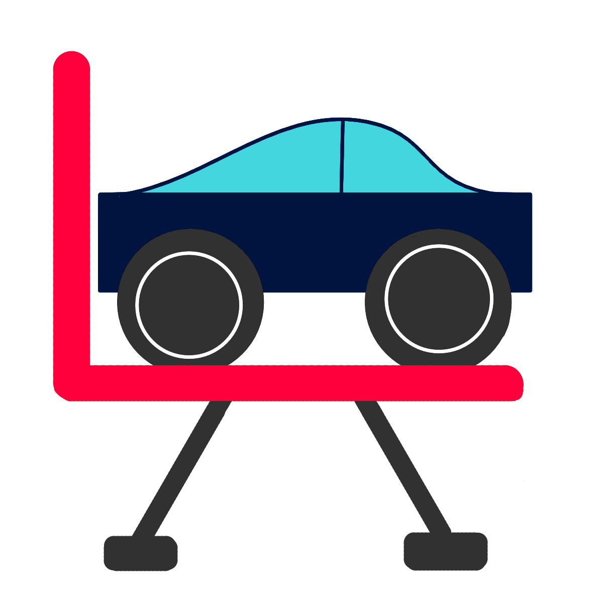

# IS7024 Final Project

## Introduction
This repository contains the code and documentation for the IS7024 Final Project. The project will combine event API from [SeatGeek](https://seatgeek.com/) and parking data from [ParkWhiz](https://www.parkwhiz.com/) to show convenient parking locations near events.

## Icon / Logo

## Storyboard / Wireframe
WIP

## GitHub Project

- [GitHub Project Board](https://github.com/poeppenz/IS7024FinalProject)

## Requirements

- As an event goer, I want to quickly find close affordable parking for my upcoming event.
  - Given I have selected an event, I want to see parking options near the event.
- As an event goer, I would like to see parking options with prices.
  - Given I have selected an event, I would like to see parking options with available times that match my event time.
- As an event goer, I would like to find my event.
  - Given I am on the homepage, I would like to search for an event by name, date, or location. 
- As an event goer, I would like to click on a link to purchase parking.
  - Given I have selected a parking option, I would like to be redirected to the parking provider's website to complete my purchase.
    

## Tasks

- [x] Research and select APIs for event and parking data.
- [X] Implement API integration for event data. SeatGeek
- [X] Implement API integration for parking data. ParkWhiz
- [ ] Finalize a project name. EventParking
- [ ] Develop frontend components to display events and parking options.
- [ ] Test the application for usability and performance.
- [ ] Deploy the application to a Azure.
## Examples: 1.
Event and parking search data are available and accessible.
### Assumptions
Events names and locations are stated clearly 
Closest parking, spot spaces well stated.

**Provide**: Location

**Seat**: Available

**When** I search for “Seat Greek”
Then I should receive at least one result with these attributes:

Location: Paycor Stadium Cincinnati

Availability: Section 114, Row 1

Parking Spot: CRG west garage  spot A34 | Lot B - C14 | Lot A - B27
 

## Criteria checklist
- [X] Two external API sources
- [ ] One AI from another group
- [X] Common Github repository
- [ ] Code in good form
- [ ] Do something extra
- [ ] Code Review recommendations implemented and explained
- [ ] Hosted in Azure
- [ ] Show results of JSON service data in readable form
- [ ] Produce data via REST/JSON with an OpenAPI or JSON Schema
- [ ] Gather data from user
- [ ] Site looks good - CSS, images, theme
- [ ] Accessible

## Data Sources

- [SeatGeek API Documentation](https://seatgeek.com/build) - Approved
- [ParkWhiz API Documentation](https://developer.parkwhiz.com/) - Approved
- [Spot Hero API Documentation](https://spothero.com/developers) - Rejected

## Members

- Nathan Poeppelman - poeppenz@ucmail.uc.edu
- Michael Seitz - seitzme@mail.uc.edu
- Zachary Durst - durstzd@mail.uc.edu
- Cassandra Horton - hortonco@mail.uc.edu
- Monica Mwangi - mwangima@mail.uc.edu

## Weekly Meetings
- Meetings will be held every Tuesday at 9 PM via Teams.
