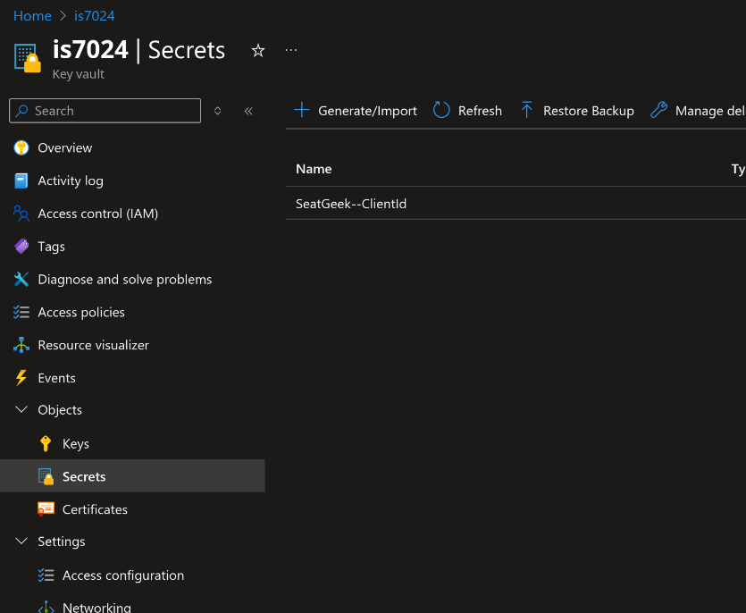
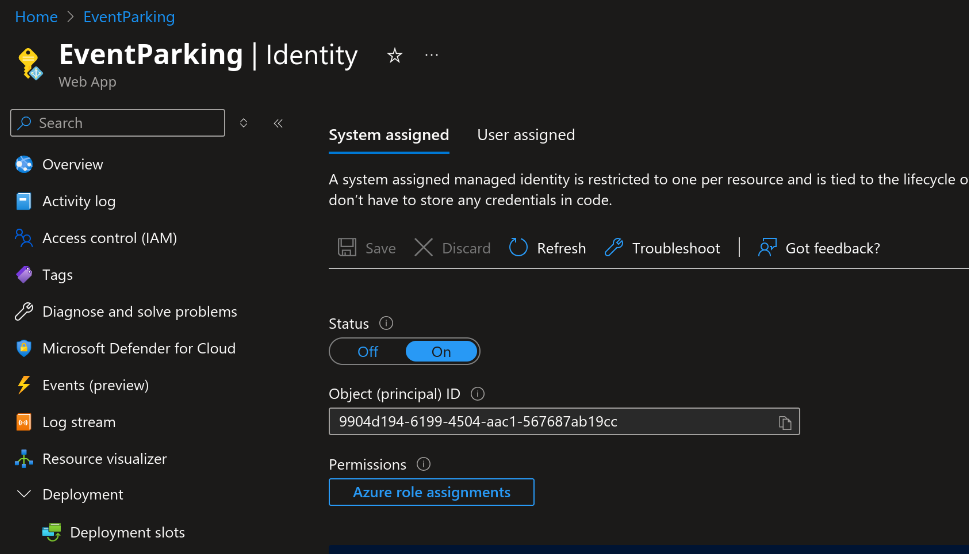
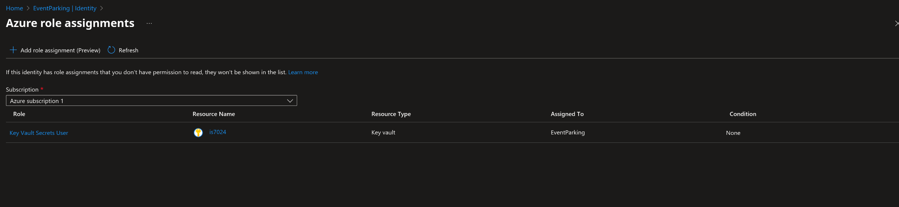
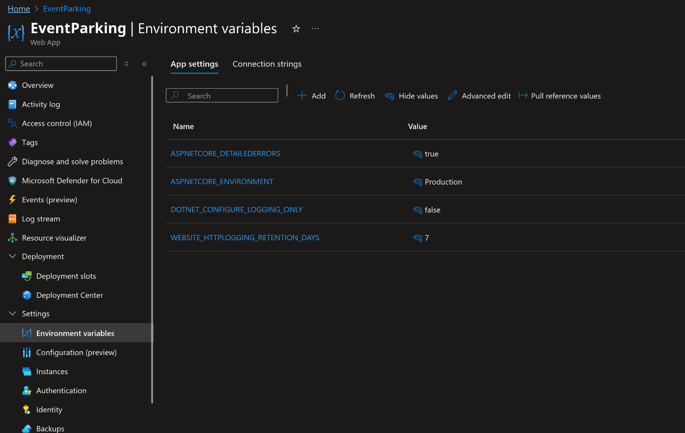
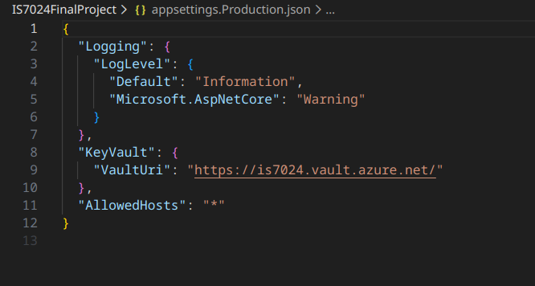
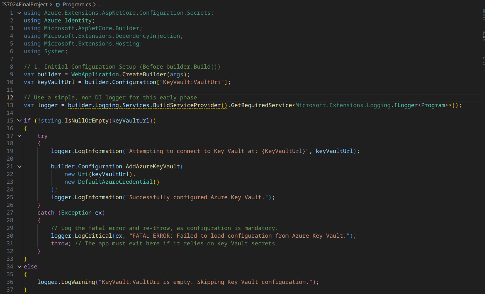

This is not meant to be exhaustive documentation, just a quick reference for some other group members to answer some questions that came up. 

  

  

  

  

  

  

Added packages:  

Azure.Identity  
Microsoft.Extensions.Configuration.AzureKeyVault  